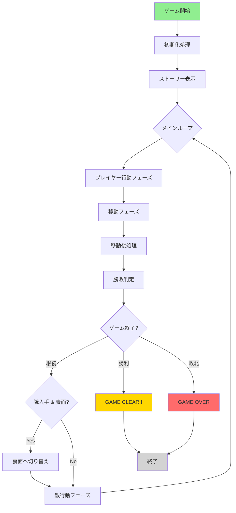
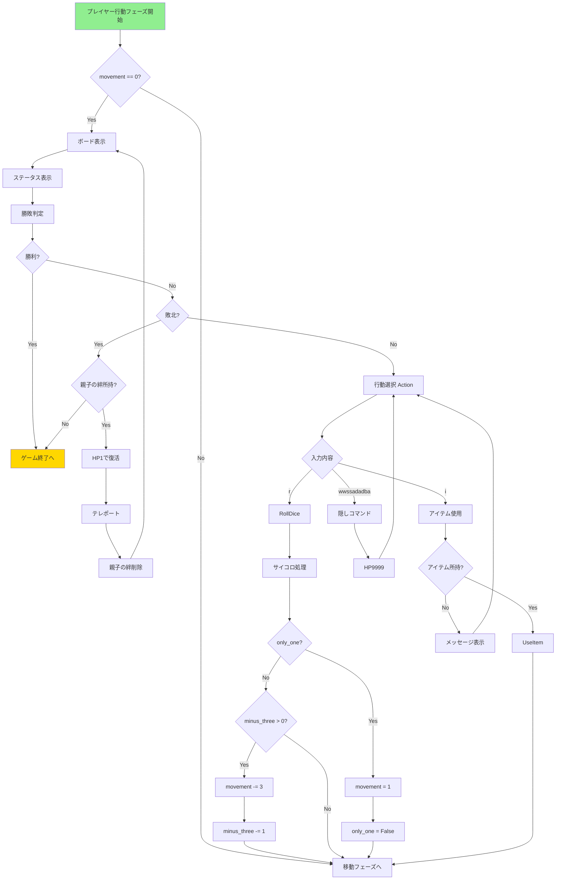
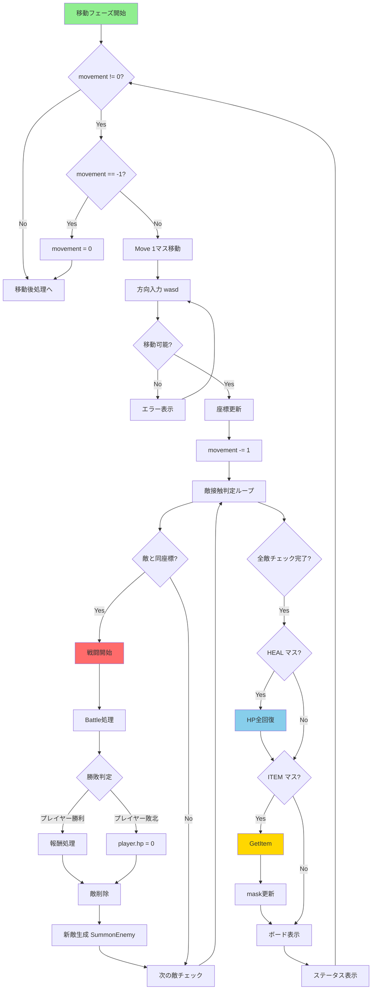
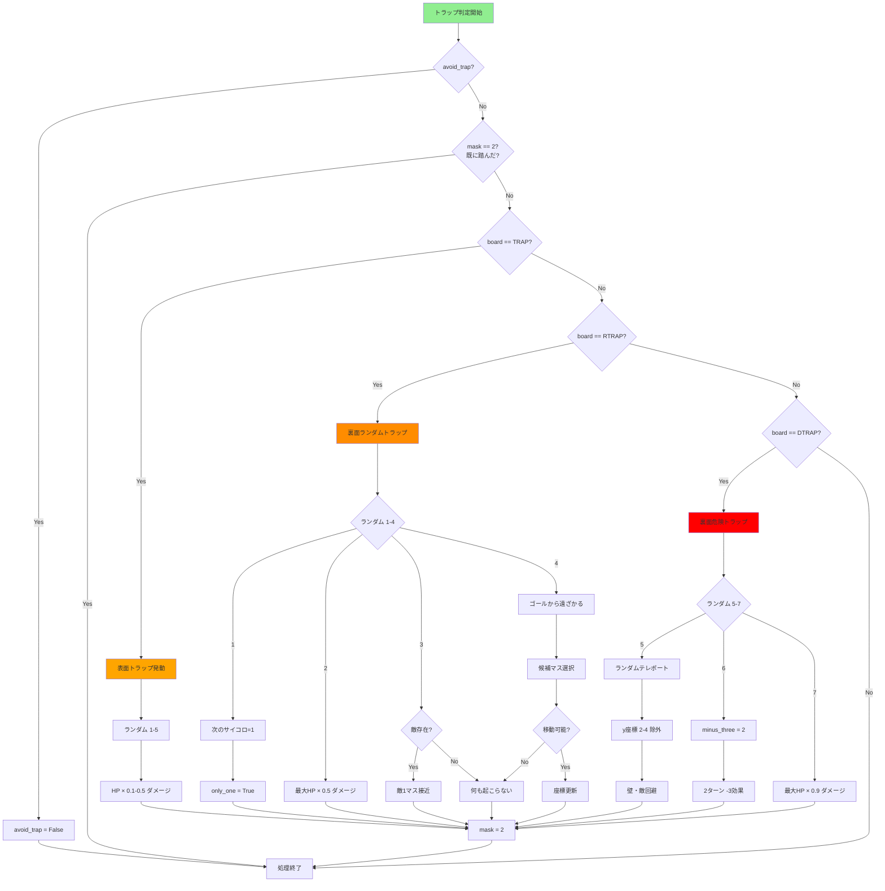
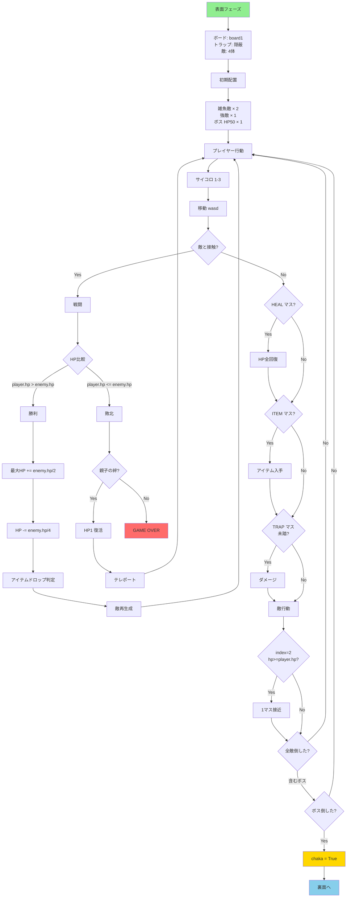
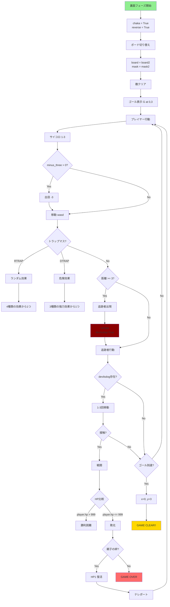
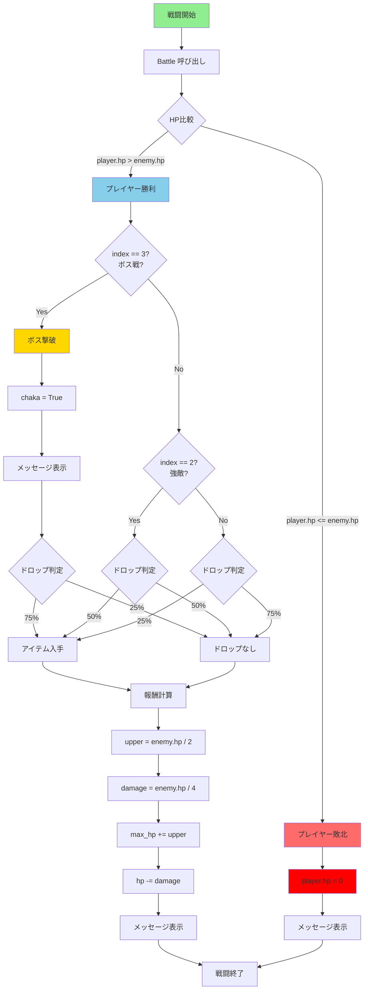
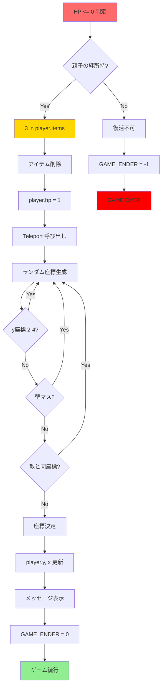

# Yakushaka beta ver1.0

## 目次
- [1. プロジェクト概要](#1-プロジェクト概要)
- [2. ファイル構成](#2-ファイル構成)
- [3. 定数定義](#3-定数定義)
- [4. クラス設計](#4-クラス設計)
- [5. 関数一覧](#5-関数一覧)
- [6. メインループ処理フロー](#6-メインループ処理フロー)
- [7. フローチャート](#7-フローチャート)

---

## 1. プロジェクト概要

### ゲーム概要
ヤクザの新入りとなり、梅田駅の警察から拳銃（チャカ）を奪取して逃走するボードゲーム型RPG。

### ゲームの流れ
1. **表面フェーズ**: マップを移動し、敵を倒しながら成長し、ボス（警官）を倒して銃を入手
2. **裏面フェーズ**: 銃を入手後、トラップだらけのマップで追手から逃げながら入口に戻る

### 技術仕様
- 言語: Python 3.x
- ゲームタイプ: ターン制ボードゲーム
- 入力方式: コマンドライン（テキスト入力）
- AI機能: A*探索アルゴリズムによる経路探索（実装済み、未使用）

---

## 2. ファイル構成

```
project_root/
│
├── main.py                      # メインエントリーポイント（ゲームループ）
│
└── yakuchaka/                   # ゲームロジックパッケージ
    ├── __init__.py              # パッケージ初期化
    ├── constants.py             # 定数定義
    ├── player.py                # Playerクラス
    ├── enemy.py                 # Enemyクラス
    ├── board.py                 # ボード生成関連
    ├── game_utils.py            # ゲームユーティリティ関数
    ├── story.py                 # ストーリー表示
    └── pathfinding.py           # A*経路探索（未使用）
```

### 各ファイルの役割

| ファイル | 役割 |
|---------|------|
| `main.py` | ゲーム全体のメインループを制御 |
| `constants.py` | マスの種類やゲーム状態を表す定数を定義 |
| `player.py` | プレイヤーキャラクターの状態と行動を管理 |
| `enemy.py` | 敵キャラクターの状態と行動を管理 |
| `board.py` | ゲームボードの生成（表面/裏面、マスク） |
| `game_utils.py` | ボード表示、アイテム、トラップ、勝敗判定などの補助関数 |
| `story.py` | ゲーム開始時のストーリーと操作説明を表示 |
| `pathfinding.py` | A*探索による最短経路探索（今後の拡張用） |

---

## 3. 定数定義

### `constants.py`

```python
# マスの種類
ITEM = 1          # アイテムマス
HEAL = 2          # 回復マス
TRAP = 3          # トラップマス（表面）
RTRAP = 4         # ランダムトラップマス（裏面）
DTRAP = 5         # 危険トラップマス（裏面）
FLAG = 6          # フラグマス（未使用）
WALL = -1         # 壁マス

# ゲーム状態
GAME_ENDER = 0    # ゲーム終了フラグの初期値
```

### マスの種類の説明

| 定数 | 値 | 説明 |
|-----|----|----|
| `ITEM` | 1 | アイテムが配置されている（マスクで隠されている） |
| `HEAL` | 2 | 踏むとHPが全回復する休憩所 |
| `TRAP` | 3 | 表面フェーズのトラップ（踏むとダメージ） |
| `RTRAP` | 4 | 裏面フェーズのランダム効果トラップ |
| `DTRAP` | 5 | 裏面フェーズの危険トラップ（強力な効果） |
| `WALL` | -1 | 通行不可の壁 |

---

## 4. クラス設計

### 4.1 `Player` クラス（`player.py`）

プレイヤーキャラクターの状態と行動を管理するクラス。

#### 属性

| 属性名 | 型 | 説明 |
|-------|----|----|
| `max_hp` | int | 最大HP |
| `hp` | int | 現在HP |
| `x` | int | X座標（横位置） |
| `y` | int | Y座標（縦位置） |
| `items` | list | 所持アイテムのリスト（最大5個） |
| `movement` | int | 残り移動可能マス数 |
| `avoid_trap` | bool | トラップ無効化フラグ（安全靴使用時） |
| `only_one` | bool | 次のサイコロが1固定フラグ |
| `minus_three` | int | サイコロ-3効果の残りターン数 |
| `chaka` | bool | 銃（チャカ）を所持しているか |

#### メソッド

##### `__init__(self, hp, x, y)`
コンストラクタ。初期HP、初期座標を設定。

##### `RollDice(self)`
サイコロを振って移動力を決定。
- 1～3のランダムな値を`movement`に加算
- `only_one`がTrueの場合、強制的に1にする
- `minus_three`が1以上の場合、-3する

##### `UseItem(self, index, board)`
指定したインデックスのアイテムを使用。

| アイテムID | アイテム名 | 効果 |
|-----------|----------|------|
| 1 | 止血剤 | HPを全回復 |
| 2 | 安全靴 | このターンのトラップを無効化 |
| 3 | 親子の絆 | 自動発動（死亡時HP1で復活＆テレポート） |
| 4 | ドス | 最大HP+5 |
| 5 | セグウェイ | ターン消費せず1マス移動 |

##### `Move(self, board)`
移動方向を入力させて、1マス移動。
- 入力: `w`（上）、`a`（左）、`s`（下）、`d`（右）
- 壁や範囲外への移動は不可

##### `Action(self, board)`
プレイヤーの行動選択。
- `r`: サイコロを振る
- `i`: アイテムを使用
- `wwssadadba`: 隠しコマンド（HP9999）

---

### 4.2 `Enemy` クラス（`enemy.py`）

敵キャラクターの状態と行動を管理するクラス。

#### 属性

| 属性名 | 型 | 説明 |
|-------|----|----|
| `hp` | int | 敵のHP（戦闘力） |
| `x` | int | X座標 |
| `y` | int | Y座標 |
| `devilsdog` | bool | 特殊敵フラグ（追跡者、HP999） |

#### メソッド

##### `__init__(self, hp, x, y, dd=False)`
コンストラクタ。HP、座標、特殊敵フラグを設定。

##### `Battle(self, index, player)`
プレイヤーとの戦闘処理。
- プレイヤーHP > 敵HP: プレイヤー勝利
  - プレイヤーの最大HP += 敵HP / 2
  - プレイヤーのHP -= 敵HP / 4
  - アイテムドロップ判定
  - `index == 3`（ボス）の場合、`player.chaka = True`
- プレイヤーHP <= 敵HP: プレイヤー敗北
  - プレイヤーのHP = 0

##### `SearchBattle(self, index, player)`
プレイヤーと同じ座標にいるか判定し、戦闘開始。
- 同じ座標なら戦闘し、`1`を返す
- 異なる座標なら`0`を返す

##### `Move(self, board)`
ランダムに1マス移動（8方向 + 静止）。
- 壁や範囲外への移動は不可
- ルールベースAIは未実装（サボってます、とコメントあり）

---

### 4.3 `PathFinding` クラス（`pathfinding.py`）

A*探索アルゴリズムによる最短経路探索クラス（未使用）。

#### 属性

| 属性名 | 型 | 説明 |
|-------|----|----|
| `queue` | list | 未訪問ノードの待ち行列 |
| `visited` | list | 訪問済みノードのリスト |
| `path` | list | 見つかった経路 |
| `cost` | int | 経路のコスト |
| `search_name` | str | 探索アルゴリズム名 |

#### メソッド

##### `find_path(self, board, start, goal)`
A*探索で最短経路を探索。
- `board`: ゲームボード
- `start`: スタート座標 `[y, x]`
- `goal`: ゴール座標 `[y, x]`
- 戻り値: 経路が見つかったら`True`、見つからなければ`False`

##### `get_next_move(self, board, start, goal)`
次の移動先を取得。
- 戻り値: 次の座標 `[y, x]` or `None`

##### `get_full_path(self)`
最後に見つけた経路全体を取得。

##### `get_path_cost(self)`
最後に見つけた経路のコストを取得。

---

### 4.4 `Node` クラス（`pathfinding.py`）

A*探索用のノードクラス。

#### 属性

| 属性名 | 型 | 説明 |
|-------|----|----|
| `parent` | Node | 親ノード |
| `position` | list | ノードの位置 `[y, x]` |
| `g` | int | スタートからの実コスト |
| `h` | int | ゴールまでの推定コスト（ヒューリスティック） |
| `f` | int | 総コスト（g + h） |

---

## 5. 関数一覧

### 5.1 `board.py` - ボード生成関連

#### `MakeBoard(size, trap, wall, heal)`
表面フェーズのボードを生成。
- `size`: ボードのサイズ（7x7）
- `trap`: トラップの数
- `wall`: 壁の数
- `heal`: 回復マスの数
- 戻り値: 2次元リスト（ボード）

#### `MakeReverseBoard(size, trap, wall)`
裏面フェーズのボードを生成。
- 中央（3,3）に壁を配置
- 危険トラップ（DTRAP）を特定位置に配置
- ランダムトラップ（RTRAP）を配置
- 壁を配置（連続しすぎないように制御）

#### `MaskBoard(size, item, board)`
アイテムマスを隠すマスクを生成（表面フェーズ用）。
- アイテムマスの位置をランダムに決定
- 戻り値: マスク用の2次元リスト

#### `ReverseMaskBoard(size)`
裏面フェーズのマスク（空のマスク）を生成。

---

### 5.2 `game_utils.py` - ゲームユーティリティ

#### `ShowBoard(board, mask, player, enemys)`
現在のボード状態を表示。

表示記号:
- `P`: プレイヤー
- `G`: ゴール（銃入手後の入口）
- `数字`: 敵のHP
- `?`: 未発見のアイテム
- `H`: 回復マス
- `T`: トラップ（踏んだ後に表示）
- `D`: 危険トラップ
- `X`: 壁
- 空白: 通常マス

#### `GetItem(player)`
ランダムなアイテムを入手。

確率分布:
- 10%: 親子の絆（アイテムID=3）
- 30%: 止血剤（アイテムID=1）
- 20%: ドス（アイテムID=4）
- 20%: 安全靴（アイテムID=2）
- 20%: セグウェイ（アイテムID=5）

所持数が5個の場合は入手できない。

#### `SummonEnemy(player, index, board, enemys)`
敵を生成してランダムな位置に配置。

| index | 敵の種類 | HP計算 |
|-------|---------|--------|
| 0, 1 | 雑魚敵 | プレイヤー最大HP × 0.5～0.9 |
| 2 | 強敵 | プレイヤー最大HP × 1.2 |
| 3 | ボス（警官） | 固定50 |
| 4 | 追跡者 | 固定999（`devilsdog=True`） |

#### `ShowStatus(player)`
プレイヤーの現在のステータスを表示。
- 現在HP / 最大HP
- 所持アイテムリスト

#### `Trap(player, enemys, board)`
トラップの効果を発動。

##### TRAP（表面）
- プレイヤーHPの10～50%のダメージ

##### RTRAP（裏面ランダム）
1. 次のサイコロが1に固定
2. 最大HPの50%ダメージ
3. 敵が1マス近づく
4. ゴールから遠ざかる（1マス移動）

##### DTRAP（裏面危険）
1. ランダムな位置にテレポート
2. 2ターンの間サイコロ-3
3. 最大HPの90%ダメージ

#### `WinChecker(player)`
勝敗判定。
- `player.chaka == True`かつ`(x, y) == (0, 3)`: 勝利（戻り値1）
- `player.hp <= 0`: 敗北（戻り値-1）
- それ以外: 継続（戻り値0）

#### `Teleport(player, board, enemys)`
プレイヤーをランダムな位置にテレポート。
- y座標が2～4の範囲（中央付近）は除外
- 壁や敵の位置は避ける

---

### 5.3 `story.py` - ストーリー表示

#### `Story(board, mask, player, enemys)`
ゲーム開始時のストーリーと操作説明を表示。
- ストーリー: 5段落
- 操作説明: 22項目
- 各3行ごとに表示し、Enterで次へ（`s`でスキップ）

---

## 6. メインループ処理フロー

### 6.1 初期化処理（`main.py`）

```python
# ボード生成
board1 = MakeBoard(7, 4, 4, 2)          # 表面ボード
board2 = MakeReverseBoard(7, 7, 10)     # 裏面ボード
mask1 = MaskBoard(7, 2, board1)         # 表面マスク
mask2 = ReverseMaskBoard(7)             # 裏面マスク

# プレイヤー初期化
player = Player(15, 0, 3)               # HP15、座標(0,3)

# 敵生成（4体）
enemys = []
for i in range(3, -1, -1):
    enemys.insert(0, SummonEnemy(player, i, board1, enemys))

# 初期ボード設定
board = board1
mask = mask1
reverse = False                         # 裏面フラグ

# ストーリー表示
Story(board, mask, player, enemys)
```

---

### 6.2 メインループ構造

```
while True:
    ├─ フェーズ1: プレイヤー行動フェーズ
    │   └─ while player.movement == 0:
    │       ├─ ボード表示
    │       ├─ ステータス表示
    │       ├─ 勝敗判定
    │       ├─ 親子の絆チェック（死亡時）
    │       └─ プレイヤー行動選択（Action）
    │
    ├─ フェーズ2: 移動フェーズ
    │   └─ while player.movement != 0:
    │       ├─ 1マス移動（Move）
    │       ├─ 移動力-1
    │       ├─ 敵との接触判定（SearchBattle）
    │       │   └─ 戦闘発生時、敵を再生成
    │       ├─ 回復マス判定
    │       ├─ アイテム取得判定
    │       ├─ ボード表示
    │       └─ ステータス表示
    │
    ├─ フェーズ3: 移動後処理
    │   ├─ 勝敗判定
    │   ├─ 親子の絆チェック
    │   ├─ トラップ判定
    │   │   └─ avoid_trap == False かつ 未踏トラップの場合発動
    │   └─ マスクに踏んだ記録（mask[y][x] = 2）
    │
    ├─ フェーズ4: 勝敗判定
    │   ├─ 勝敗判定
    │   └─ 親子の絆チェック
    │
    ├─ フェーズ5: フェーズ切り替え判定
    │   └─ if player.chaka == True and reverse == False:
    │       ├─ reverse = True
    │       ├─ enemys.clear()
    │       ├─ board = board2
    │       ├─ mask = mask2
    │       └─ メッセージ表示
    │
    └─ フェーズ6: 敵行動フェーズ
        ├─ 追跡者出現判定（距離3以上で出現）
        └─ 各敵の行動
            ├─ devilsdog == True: 1～3回移動
            ├─ index == 2 かつ hp >= player.hp: 1回移動
            └─ 敵との接触判定
```

---

### 6.3 ゲーム終了条件

#### 勝利条件
```python
player.chaka == True and player.x == 0 and player.y == 3
```
銃を所持し、入口（0, 3）に到達

#### 敗北条件
```python
player.hp <= 0 and (3 not in player.items)
```
HPが0以下で、親子の絆を所持していない

---

## 7. フローチャート

### 7.1 全体フロー



**対応コード**: `main.py`の全体構造

---

### 7.2 プレイヤー行動フェーズ



**対応コード**: 
- `main.py`の`while(player.movement == 0):`ループ
- `player.py`の`Action()`、`RollDice()`、`UseItem()`メソッド

---

### 7.3 移動フェーズ



**対応コード**:
- `main.py`の`while(player.movement != 0):`ループ
- `player.py`の`Move()`メソッド
- `enemy.py`の`SearchBattle()`、`Battle()`メソッド
- `game_utils.py`の`GetItem()`関数

---

### 7.4 トラップ処理フロー



**対応コード**:
- `main.py`のトラップ判定処理
- `game_utils.py`の`Trap()`関数

---

### 7.5 表面フェーズ（銃入手前）



**対応コード**:
- `main.py`の`reverse == False`時の処理
- `board.py`の`MakeBoard()`、`MaskBoard()`
- `game_utils.py`の`SummonEnemy(player, 0-3, ...)`

---

### 7.6 裏面フェーズ（銃入手後）



**対応コード**:
- `main.py`の`if(player.chaka == True and reverse == False):`ブロック
- `main.py`の敵行動フェーズ（`devilsdog`判定含む）
- `board.py`の`MakeReverseBoard()`、`ReverseMaskBoard()`
- `game_utils.py`の`SummonEnemy(999, 4, ...)`

---

### 7.7 戦闘処理詳細



**対応コード**:
- `enemy.py`の`Battle()`メソッド
- `game_utils.py`の`GetItem()`関数

---

### 7.8 親子の絆（復活処理）



**対応コード**:
- `main.py`の親子の絆チェック処理
- `game_utils.py`の`Teleport()`関数

---

## 補足情報

### ゲームバランス設計

#### HP設計
- プレイヤー初期HP: 15
- 雑魚敵HP: プレイヤー最大HP × 0.5～0.9
- 強敵HP: プレイヤー最大HP × 1.2
- ボスHP: 固定50
- 追跡者HP: 固定999（実質倒せない）

#### 成長曲線
戦闘勝利時:
- 最大HP増加 = 敵HP ÷ 2
- ダメージ = 敵HP ÷ 4
- 実質HP増加 = 敵HP ÷ 4

約4回の戦闘でボス（HP50）に挑める設計。

#### アイテムドロップ率
- 雑魚敵: 25%
- 強敵: 50%
- ボス: 75%

---

### 今後の拡張予定

1. **AI経路探索の実装**
   - `PathFinding`クラスを`Enemy.Move()`に統合
   - 難易度設定によってAI追跡率を調整

2. **セーブ/ロード機能**
   - ゲーム状態の保存
   - 途中からの再開

3. **複数マップ**
   - ステージ選択
   - 異なるマップサイズ

4. **GUI化**
   - Tkinter/Pygame による視覚化
   - マウス操作対応

---

## 変数・関数命名規則

### 命名規則
- クラス名: PascalCase（例: `Player`, `PathFinding`）
- 関数名: PascalCase（例: `ShowBoard`, `GetItem`）
- 変数名: snake_case（例: `player_hp`, `board_size`）
- 定数名: UPPER_CASE（例: `WALL`, `ITEM`）

### 座標系
- `[y, x]`形式（行、列の順）
- 左上が`[0, 0]`、右下が`[6, 6]`
